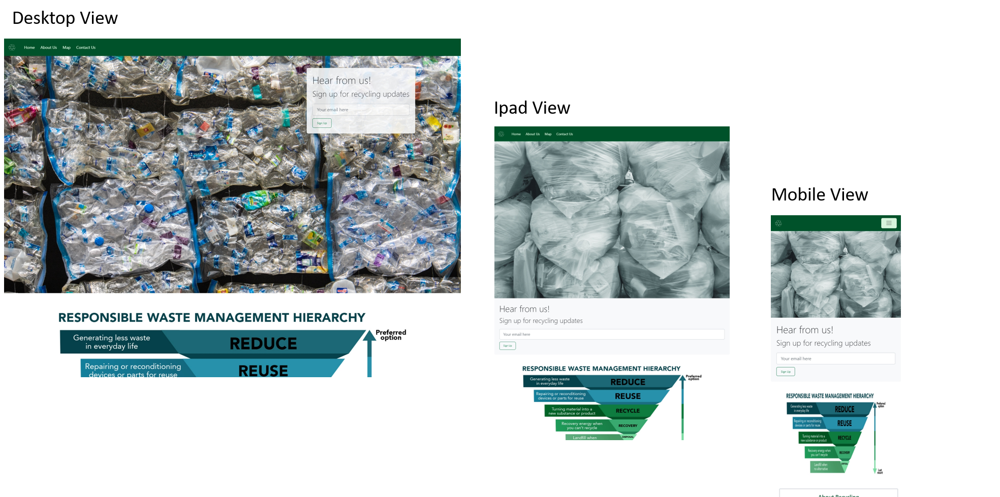
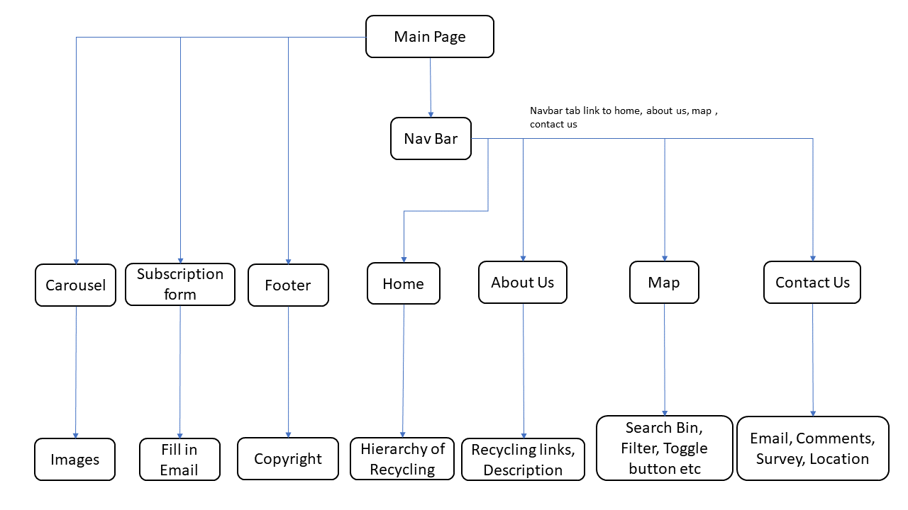
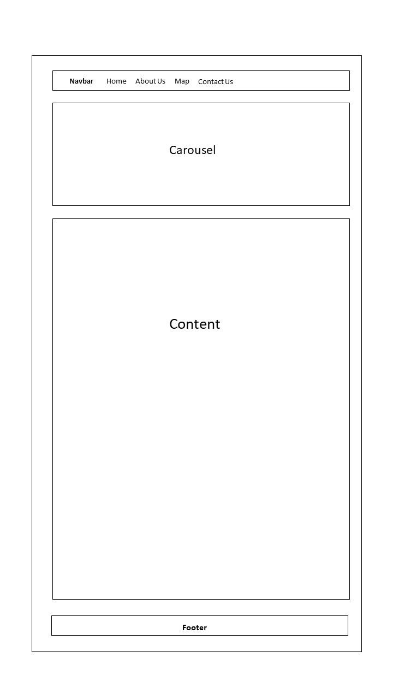
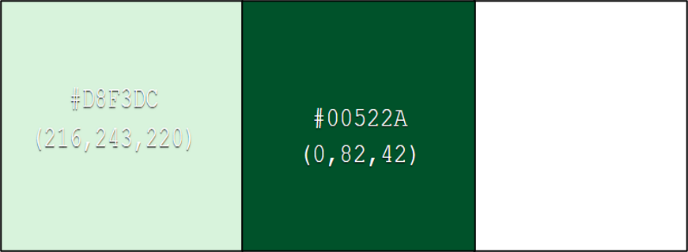

# Title : Frontend Assignment 1 - Green Recycling Project
* A brief layout of project work in different screen version
* Objective: To bring awareness about the importance of recycling, saving the environment

# Content
1. Summary of project
2. UX/UI 
3. Features 
4. User Stories
5. Technologies Used
6. Testing 
7. Test Cases
8. Deployment
9. Live Link
10. Credits and Acknowledgement

## 1. Summary
* Lots of unwanted waste are disposed and it is harming the environment
* Seeing waste being disposed without much consideration, it sparks the owner's idea to create awareness about recycling

## 2. UI/UX

### 2.1 Scope
The purpose of this green project is to promote awareness of recycling, let public know about the importance of green environment. Users are able to locate recycling bin location by using webpage map

### 2.2 Strategy 
* Create a webpage to inform public and audience about the importance of recycling
webpage(mainly green and white color theme to promote a green and clean concept to save our environment.)
* Provide location of main recycling bin, lighting recycling waste bin, second hand recycling point and electronic waste point. Enable public to dispose their waste.

#### 2.2.a. User Goals
* Targeted Audience: Public,Schools and Government Bodies
* Users are able to find their desired recycling bin location using the web search function
* Users are able to locate various types of recycling bin (main, lighting, electronic, second hand)
* Users are able to obtain recycling information 

#### 2.2.b. Organisation's Goals
* Able to provide relevant recycling information and knowledge to the public

### 2.3 Structure
 * Nav bar: dark green background 
  Nav bar: recycling logo 
  Nav bar: contains tab - home, about us, map, contact us (able to link to respective page when click) 
  Nav bar:  home, about us, map, contact us (color will change to green when mouse hover over tab) 

* Carousel: 3 images - cardboard, plastic bags, plastics bottle 

* Subscription form: a subscription form embedded within carousell in large screen 
  Subscription form: will be below carousell when in smaller mobile version 

* Home page: hierarchy of recycling 

* About us: provide ul and li of items for About recycling , 3Rs (reduce, reuse, recycle), Promoting recycling 

* Map: able to locate location using search bar(top center section) 
  Map: top left hand corner. non-default leaflet cutomise zoom in(+) zoom out(-) function 
  Map: top right hand corner. filter layer to filter location of main recycling, lighting , second hand, e-waste bin 
  Map: filter layer no clustering for lighting recycling bin. Only 2 locations, only on or off location   
  Map: lower left hand corner. show or hide cluster of second hand, e-waste bin. Show or hide of general main waste bin 
  Map: row just below of the map. center of green bar shows the various types of icon legend. When hover-description name of icon will popup 
  Map: when legend icon is click it will toggle on or off of the respective types of binicon location in the map 

* Contact us form: email, comments, rating, hear about us 
  Contact us form: will show validation error if no input upon clicking submit button. will show submitted details upon submission 

* Location: address details with map 

### 2.4 Skeleton
Webpage consists of simple 3 components
* Navbar
* Body
* Footer

Navbar is located at the top of webpage. 
Navbar consists of logo and name hyperlinks to respective pages. 
Footer at the bottom page with copyright and font aswesome logo. 

### 2.5 Surface 

#### 2.5.a Background 
* Background Colors: Green and white to promote clean and green environment 
* Button Colors : Green, Blue, Red, Light Green 

#### 2.5.b Typography 

* Font Color :Light green/ dark green/ white to blend with the background color
* Font Family: Normal
* Font Size : 0.6 - 1 rem, h1,h2 to match with background settings

#### 2.5.c Images 
* Images : Use recycling images for carousel, recycling icon and logo to fit the theme
* Website is able to view in mobile size (XS) and for large display like desktop

#### 2.5.c Icons 
* Different png icons are used to differentiate the types of bins
* Icons colour : Mainly bright colors (etc. yellow, green, blue) to stand out from the map

## 3. Features 

### Navigation Bar 
  * Home, About us, Map, Contact us(click tab to link to respective page)
### Subscription Form  
  * User may key in their email to the email box to get recycling news. 
    Error will display if no input upon submission 
### About Us 
  *  Under the list there is a click here at the bottom to link to recycle website for more information
### Map  
  * SearchBar 
    Searchbar uses debounce technique to search for results, to prevent system from overloading 
    Users are able to enter address or postal code into searchbar to search for nearby main recycling bins 
    Maximum of up to 10 search results will be shown at a time when user key in a valid address 
  * Filter Layer 
    Users can filter to see different types of bins(top-right)( main, lighting, secondhand, ewaste)
  * Zoom Function 
    User able to use the self customise zoom in zoom out function to view the map size they wanted
  * Toggle Button 
    Toggle hide or show cluster button at bottom left of map (for secondhand and  ewaste only) 
    Toggle hide - red color button 
    Toggle show - blue color button
  * Hide or show general waste button 
    Hide or show general waste button beside toggle button at bottom left of map (General main recycling waste only) 
    Hide general waste - red color button 
    Show general waste - blue color button
  * Legend Icon  
    Just below the map, the dark green bar shows the legend icon of various types of recycling bin 
    When user hover mouse over icon, icon is able to show name of the various bin types 
    When user clicks on icon, the map will display the respective types of bins 
    When legend icon displays color - not click 
    When legend icon is opaque in color - the icon is click 
### Contact us 
  * User able to select the type of questions they want to enquire, type in email, comments, hear about us and rate experience. 
    Error will display if no input upon submission 
    Upon submission a confirmation of user input details will show  
  

## 4. User Stories
1. As a user i would like to know the various recycling points around singapore and website information to dispose my waste for recycling 
2. As a user i would like to know other websites that provides tips and information about recycling

### 4.1 Acceptance criteria
1. Webpage allows user's to search for a specific area and able to view the details of the bin location by clicking on the bin icon 
2. Project Webpage is able to enable users to link to other recycling or green environment webpage for more recycling information

## 5. Technologies Used
* HTML
* CSS
* Javascript
* Axios - importing data from json file 
* [LeafletJS](https://leafletjs.com/) map features
* [Bootstrap](https://getbootstrap.com/docs/5.0/getting-started/introduction/) aligning content, match its mobile responsiveness,carousel
* [Flaticon](https://www.flaticon.com/) map icons and legend
* [Canva](https://www.canva.com) basically green and white colour theme for webpage
* [Googlemap](https://www.google.com/maps) for company location
* [Onemap](https://www.onemap.gov.sg/docs/maps/) use onemap and leaflet to incorporate onemap map

## 6. Testing  

|Categories      |Sections                       |Test Output                                                                                                   |
| :-------       | :------------                 | :-------------------                                                                                         |
|Webpage         |Mobile Responsiveness          |No visible error                                                                                              |
|Navigation Bar  |Home Tab                       |Able to link to Home section, when hover color will change                                                    |
|Navigation Bar  |About Us Tab                   |Able to link to About us section, when hover color  will change                                               |
|Navigation Bar  |Map Tab                        |Able to link to Map section, when hover color will change                                                     |
|Navigation Bar  |Contact Us Tab                 |Able to link to Contact Us section, when hover color will change                                              |
|Navigation Bar  |Mobile Responsiveness          |Shrink according to screen size, those links in navbar will be hidden in nav dropdown button                  |
|Carousel        |Images                         |Able to auto slide, change to next image                                                                      |
|Carousel        |Mobile Responsiveness          |Shrink according to screen size, autoslide function still works in different screen size                      |
|Content         |Subscription form              |Able to submit and show user input upon submission.                                                           |
|Content         |Subscription form              |Show error when no input/invalid input                                                                        |  
|Content         |Home                           |Image of hierachy fits the background                                                                         |
|Content         |About Us                       |Click here links under each boxes, able to link to the desire webpage for more information                    |
|Content         |Map                            |Searchbar (topmost center portion of map), able to search for max 10 results                                  |
|Content         |Map                            |Zoom in/Zoom out buttons(top left), able to function                                                          | 
|Content         |Map                            |Show Cluster and General waste buttons(bottom left) works well                                                |
|Content         |Map                            |Filter check box able to display or hide recycling bin (top right)                                            |
|Content         |Map                            |4 recycle legend icon bar right below the map able to toggle on off recycling bin location when click         |
|Content         |Contact us Form                |Forms are able to process values and dislay errors if no input when submitted                                 |
|Content         |Location                       |Able to show address under google map                                                                         |
|Content         |Mobile Responsiveness          |Able to view in mobile version to large screen                                                                |
|Footer          |Mobile Responsiveness          |Able to view in mobile version to large screen                                                                |
## 7. Test case 
|Test Case #  |Test Case Description                       |Test Steps                                       |  Expected Result                                |
| :-------    | :------------                              | :-------------------                            | :-------------------                            |
|             | Prerequisite: User is at Navigation bar    |                                                 |                                                 |
|  1          | Click on tabs to direct to page            | 1) Click on respective tab                      | 1) Direct user to respective page section       |
|             |                                            | (Home,About Us,Map,Contact Us)                  |                                                 |
|             | Prerequisite: User is at Subscription Page |                                                 |                                                 |
|  2          | Sign up for updates                        | 1) Email box                                    | 1) Input email in email box (eg.trent@gmail.com) |
|             |                                            | 2) Click submit button                          | 2) Alert showing inputs details submitted       |
|             |                                            | 3) Key in invalid email                         | 3) error-Please enter valid email               |
|             | Prerequisite: User is at Map section       |                                                 |                                                 |
|  3          | Search for Bin Location                    | 1) Input address or postal code (eg.50323)      | 1) List of search results                       |
|             |                                            | 2) Click find button or address under searchlist| 2) Zoom in to map location                      |
|             |                                            | 3) Key in invalid address                       | 3) No results will display                      |
|             | Prerequisite: User is at Map section       |                                                 |                                                 |
|  4          | Zoom in Zoom out Buttons                   | 1) Click on Zoom In (+)                         | 1) Enlarge/zoom into location                   |
|             |                                            | 2) Click on Zoom Out (-)                        | 2) Zoom out of map                              |
|             | Prerequisite: User is at Map section       |                                                 |                                                 |
|  5          | Show Cluster Button                        | 1) Click on Show Cluster Button                 | 1) Display clustering of ewaste and second hand |
|             |                                            | 2) Click on Hide Cluster Button                 | 2) Disable clustering of ewaste and second hand |
|             | Prerequisite: User is at Map section       |                                                 |                                                 |
|  6          | General Waste Button                       | 1) Click on Show General Waste Button           | 1) Display main recycling bin location          |
|             |                                            | 2) Click on Hide General waste Button           | 2) Disable recycling bin location               |
|             | Prerequisite: User is at Map section       |                                                 |                                                 |
|  7          | Legend icon below map                      | 1) Click on one of legend icon                  | 1) Disable location of respective bin icon      |
|             |                                            | 2) Click on legend icon 2nd time                | 2) Enable  location of respective bin icon      |
|             | Prerequisite: User is at Contact us section|                                                 |                                                 |
|  8          | Emails, Forms, Survey                      | 1) Dropdown (types of question)                 | 1) Select from dropdown                         |
|             |                                            | 2) Input Email,Comments                         | 2) Input email(eg.trent@gmail.com /Input comments)|
|             |                                            | 3) Rate Service and Hear from us                | 3) Check textbox and select radio button        |
|             |                                            | 4) Click on Submit                              | 4) Recieve your feedback confirmation and input details |
|             |                                            | 5) No input                                     | 5) Error message will be shown                  |
|             | Prerequisite: User is at Contact us section|                                                 |                                                 |
|  9          | Company Location                           | 1) Click on enlarge under google map            | 1) A new page of large view map with location will show |
|             |                                            | 2) Click on Zoom in(+) Zoom out(-)              | 2) Zoom in or out in current map to view location |

## 8. Deployment
 * Using GitHubPages 
 * Using Netlify
### Steps for deployment:
 
**Github Pages**
* Log in to Github
* Remember to add, commited, and pushed changes to GitHub through gitpod.
* Access to respective respository to be deployed
* Click on settings tab
* Scroll down to Github Pages 
* Click on check it out here
* Under source select main and click save
* Web will be published public online 
* Web address with /index.html at the back

**Netlifly**
* Sign up with Netlify
* Remember to add, commited, and pushed changes to GitHub.
* Access https://www.netlify.com/ and log in to respective Github account.
* Click on green button "New site from Git" to create a new site
* For continuous deployment, select on "GitHub" 
* Disable pop-up blocker to access Github
* Search for the repository to be deployed
* Get a link for the site by clicking on "Deploy site" button
* Wait for deployment to be done
* Once done users may test their site

## 9. Live link 
 Github Link 1: https://xunne899.github.io/tgc16-project-1/ 
 Github Link 2: https://5500-xunne899-tgc16project1-h18wsxcpy4p.ws-us34.gitpod.io/index.html 
 Netlify: https://tgc-16-green.netlify.app/

## 10. Credits and Acknowledgement
### Credits to:
#### Web Source
[Datagenetics](https://datagenetics.com/blog/june52021/index.html)(recycling navbar logo) 
[unsplash.com](https://unsplash.com/s/photos/recycling)(carousel images) 
[Zero waste SG ](http://www.zerowastesg.com/)(using pictures and website information) 
[Flaticon](https://www.flaticon.com/)(using web various bins icon for my project) 
[Googlemap](https://www.google.com/maps)(using googlemap for company address location) 
[Bootstrap](https://getbootstrap.com/docs/5.0/getting-started/introduction/)(map features,widgets, carousel, listgroups,web features)  
[Data.gov.sg](https://data.gov.sg/dataset)(geojson data of recycling bin) 
[Onemap](https://www.onemap.gov.sg/docs/#introduction)(searchresults searchbar api) 
[Onemap](https://www.onemap.gov.sg/docs/maps/)(basemap api) 
[LeafletJS](https://leafletjs.com/)(map features and importing from onemap api)  
[pngfind](https://www.pngfind.com/freepng/search-icon-png/)(search bar-search icon) 
[freecodecamp.org](https://www.freecodecamp.org/news/javascript-debounce-example/)(debounce technique for serachresults) 
[color-hex.com](https://www.color-hex.com/color/)(background color scheme png in readme file) 
[responsively.app](https://responsively.app/)(capture web view of different size in readme) 
#### Mentors
* Guidance from Paul Chor(Head Instructor)
* Guidance from Ace Ang(Teaching Assistant)
* Guidance from Batch 16 Trent Global Coursemates 

